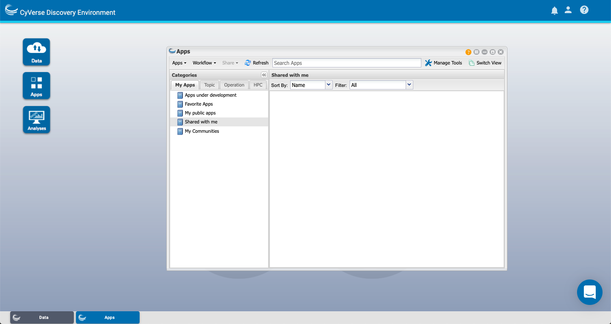
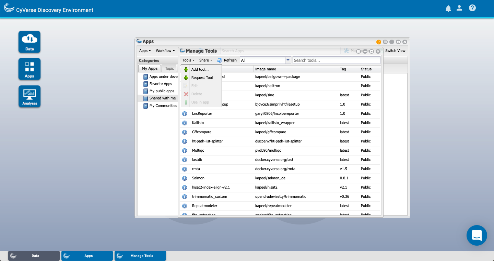
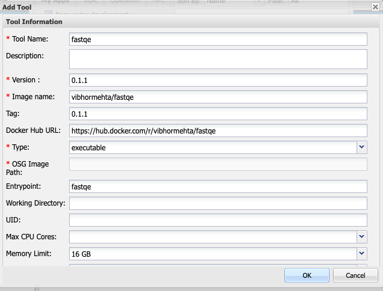

.. include:: cyverse_rst_defined_substitutions.txt

|CyVerse logo|_

|Home_Icon|_
`Learning Center Home <http://learning.cyverse.org/>`_

**How to Integrate a Tool in DE**
=================================

Goal
----
This tutorial will help you understand the process and how a tool can be integrated in the
Discovery Environment using Github and Docker.

Prerequisites
-------------

Downloads, access, and services
~~~~~~~~~~~~~~~~~~~~~~~~~~~~~~~

*In order to complete this tutorial you will need access to the following services/software*

 .. list-table::
   :header-rows: 1

   * - Prerequisite
     - Preparation/Notes
     - Link/Download
   * - CyVerse account
     - You will need a CyVerse account to complete this exercise
     - |CyVerse User Portal|
   * - Docker account
     - You need your docker account to add the tool to your docker account
     - `Docker login Portal <https://id.docker.com/login//>`_

Platform(s)
~~~~~~~~~~~

*We will use the following CyVerse platform(s):*

.. list-table::
    :header-rows: 1

    * - Platform
      - Interface
      - Link
      - Platform Documentation
      - Quick Start
    * - Discovery Environment
      - Web/Point-and-click
      - |Discovery Environment|
      - |DE Manual|
      - |Discovery Environment Guide|

Input and example data
~~~~~~~~~~~~~~~~~~~~~~

*In order to complete this quickstart you will need to have the following inputs prepared*

.. list-table::
    :header-rows: 1

    * - Input File(s)
      - Format
      - Preparation/Notes
      - Example Data
    * -
      -
      -
      -

----

*Steps to Follow*
-----------------

1. Create a docker container that contains your tool

 1.1 You can create docker container by first downloading docker on your machine

 1.2 To check if docker is installed type docker help in command line or terminal

 .. code-block:: bash

     docker help

2. Once docker displays all the commands it means that it is working

 2.1 Now create a folder in your machine and then create the "Dockerfile"

 .. code-block:: bash

     mkdir fastqe-docker && cd fastqe-docker
     nano Dockerfile

 2.2 Dockerfile is the basic text file that will be the base of your docker image. So here is an example of fastqe "Dockerfile"

 .. code-block:: bash

     FROM ubuntu:18.04
     MAINTAINER Vibhor Mehta vibhormehta20@gmail.com
     RUN apt-get update && apt-get install -y python-pip
     RUN pip install fastqe==0.1.1
     ENTRYPOINT [ "fastqe" ]

 2.3 Once you create the "Dockerfile", you need to build the container

 .. code-block:: bash

     docker build -t fastqe:0.1.1 .

 2.4 Test the docker image by typing the following command

 .. code-block:: bash

     docker run fastqe:0.1.1 -h

     usage: fastqe [-h] [--minlen N] [--version] [--mean] [--bin] [--min] [--max]
              [--log LOG_FILE] [--scale]
              [FASTA_FILE [FASTA_FILE ...]]

    Read one or more FASTQ files, compute quality stats for each file, print as
    emoji... for some reason.

    positional arguments:
      FASTA_FILE      Input FASTQ files

    optional arguments:
      -h, --help      show this help message and exit
      --minlen N      Minimum length sequence to include in stats (default 0)
      --version       show program's version number and exit
      --mean          show mean quality per position (DEFAULT)
      --bin           use binned scores
      --min           show minimum quality per position
      --max           show maximum quality per position
      --log LOG_FILE  record program progress in LOG_FILE
      --scale         show relevant scale in output

 2.5 Now tag the image with your dockerhub-username followed by the image name.

 .. code-block:: bash

    docker tag fastqe:0.1.1 username/fastqe:0.1.1

 2.6 Now login and then push the container to DockerHub where it can be accessed by others

  .. code-block:: bash

      docker login -u username
      docker push username/fastqe:0.1.1

3. Login to the `discovery_environment <https://de.cyverse.org/de/>`_

 3.1 Go to Apps on the left hand corner

|De app|

 3.2 Click on manage tools in the top ride side of the window

 3.3 Click on Tools --> Add tool

|De create tool|

 3.4 Enter name you want to give your tool and fill the form with the required fields

|De tool name|

*Summary*
~~~~~~~~~~~

**Next Steps:**

The above tutorial can be repeated to add tools of your choice by just replacing certain
like container name, login id , tool name. Soon to come is how to add fastqe to as a tool
to the Discovery Environment.
Some common next steps include:

1. Always have a Dockerfile before trying to build your container

----

Additional information, help
~~~~~~~~~~~~~~~~~~~~~~~~~~~~

..
    Short description and links to any reading materials

Search for an answer:
|CyVerse Learning Center| or
|CyVerse Wiki|

Post your question to the user forum:
|Ask CyVerse|

----

**Fix or improve this documentation**

- On Github: |Github Repo Link|
- Send feedback: `Tutorials@CyVerse.org <Tutorials@CyVerse.org>`_

----

|Home_Icon|_
`Learning Center Home <http://learning.cyverse.org/>`__

.. Comment: Place Images Below This Line
   use :width: to give a desired width for your image
   use :height: to give a desired height for your image
   replace the image name/location and URL if hyperlinked

 .. |Clickable hyperlinked image| image:: ./img/IMAGENAME.png
    :width: 500
    :height: 100
 .. _CyVerse logo: http://learning.cyverse.org/

 .. |Static image| image:: ./img/IMAGENAME.png
    :width: 25
    :height: 25

.. Comment: Place URLS Below This Line

   # Use this example to ensure that links open in new tabs, avoiding
   # forcing users to leave the document, and making it easy to update links
   # In a single place in this document

   .. |Substitution| raw:: html # Place this anywhere in the text you want a hyperlink

      <a href="REPLACE_THIS_WITH_URL" target="blank">Replace_with_text</a>

.. |Github Repo Link|  raw:: html

   <a href="FIX_FIX_FIX_FIX_FIX_FIX_FIX_FIX_FIX_FIX_FIX_FIX_FIX_FIX_FIX" target="blank">Github Repo Link</a>

.. |Download Cyberduck| raw:: html

   <a href="https://cyberduck.io/" target="blank">Download Cyberduck</a>
